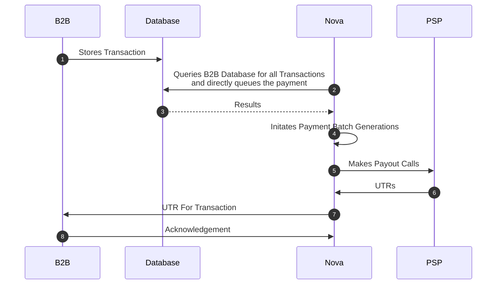

##  Current Request Flow

```mermaid
sequenceDiagram
  autonumber
  B2B->>Database: Stores Transaction
  Nova->>Database: Queries B2B Database for all Transactions <br> and directly queues the payment
  Database-->>Nova: Results
  Nova->>Nova: Initates Payment Batch Generations 
  Nova->>PSP: Makes Payout Calls
  PSP->>Nova: UTRs
  Nova->>B2B: UTR For Transaction
  B2B->>Nova: Acknowledgement
```