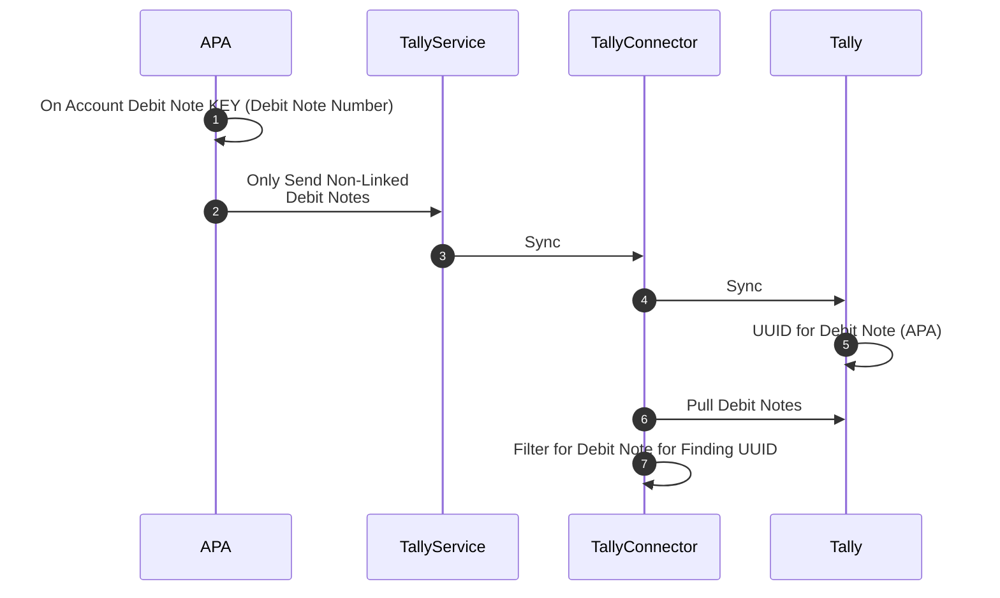

##  Current Request Flow

```mermaid
sequenceDiagram
  autonumber
  APA->>APA: On Account Debit Note KEY (Debit Note Number)
  APA->>TallyService: Only Send Non-Linked <br> Debit Notes
  TallyService->>TallyConnector: Sync
  TallyConnector->>Tally: Sync
  Tally->>Tally: UUID for Debit Note (APA)
  TallyConnector->>Tally: Pull Debit Notes
  TallyConnector->>TallyConnector: Filter for Debit Note for Finding UUID 
```